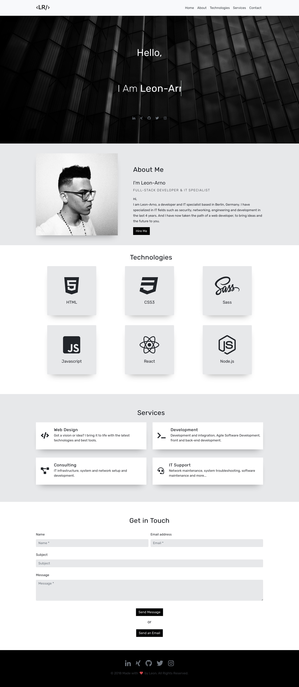

# Portfolio Website

This is a portfolio website made with a webpack & Bootstrap-Boilerplate.
## Installation

1. Clone the repository
2. Run `npm install` or `yarn` on the command line

## Build

Run the command `npm run build` to run webpack in `production` mode.

## Development

Run the command `npm run dev` to run webpack and let it watch for file changes to recompile, when needed.
